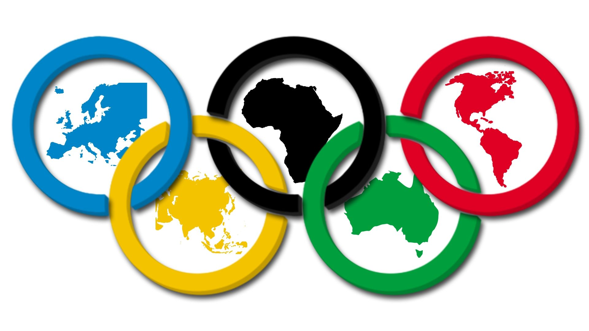

```{r,message=FALSE,warning=FALSE,}
#Librerie
library(dplyr)
library(tidyverse)
library(tidytext)
library(ggplot2)
library(plotly)
library(directlabels)
library(utils)
library(grid)
library(gridExtra)
library(highcharter)
library(countrycode)
library(shiny)
library(knitr)
```

# Introduzione
  
  <br>
Le Olimpiadi non sono solo un agglomerato di sport,attraverso di loro  e' possibile analizzare l'andamento della societa' nel corso degli anni. Le Olimpiadi moderne iniziano con Atene 1896 

L'obiettivo di questo analisi scoprire le cose piu' interessanti  delle olimpiadi,analizzando la crescita, il rapporto uomini donne, gli stati piu' vincenti...

# Dataset

```{r}
Stati=read.csv("noc_regions.csv")
df=read.csv("athlete_events.csv",stringsAsFactors = FALSE)
df=df%>%
    filter(Year!=1906)

```


Nel dataset ogni riga corrisponde ad un singolo atleta che ha gareggiato  in un singolo evento olimpico dal 1896 al 2016(sia olimpiadi invernali che estive).L'evento corrisponde alla singola categoria ad esempio l'atletica e' lo sport principale ma a sua volta e' divisa in eventi come il Salto in Alto,Salto in lungo,lancio del peso,
... .
Dal dataset sono state tolte le olimpiadi del 1906 perche' non sono considerate valide dal CIO.


Esempio di colonne del dataset:
```{r,echo=FALSE}
dfvis=df%>%
      head(5)
kable(dfvis, format = "markdown")
```

Il dataset Stati contiene invece tre colonne una con il NOC(codice dello stato), la seconda con il nome completo mentre la terza contiene delle note sullo stato
```{r}
S=Stati%>%
  head(10)
kable(S, format = "markdown")
```


## Suddivisione degli Sport

Per evitare problemi nel conteggio delle medaglie gli sport sono stati suddivisi in Sport di Squadra e Sport Singoli. Questo perche' gli sport di squadra sono considerati come singola medaglia nel medagliere totale
```{r message=FALSE,warning=FALSE,}
#Olimpiadi Estive 
Olimpiadi_Estive=df%>%
                  filter(Season=="Summer")

Sport_Squad=c("Baseball","Basketball","Beach Volleyball","Cricket","Football","Handball","Hockey","Lacrosse","Motorboating","Polo","Softball","Water Polo","Volleyball","Ice Hockey","Tug-Of-War","Curling","	Bobsleigh")
#Suddivissione Degli sport estivi in sport di squadra e sport singoli
Eventi=Olimpiadi_Estive%>%
            distinct(Sport,Event)%>%
            mutate(Type=ifelse(str_detect(Event,"Teams|Team|Double|Doubles|Relay|Fours|Tandem|Synchronized|Group|Quadruple|Pairs|Eights|6-Man|17-Man|Rugby|Two Person|Three Person|Duet|Sailing Mixed|Alpinism Mixed|Men's Madison|Art Competitions Mixed Architecture, Architectural Designs|Sailing Men's Skiff")|Sport %in% Sport_Squad,"Squad","Single"))## Uso il string detect per controllare gli sport di squadra ovvero se contengono le parole che indicano lo sport di squdra
EventiDiSquadra_Estivi=Eventi%>%
                filter(Type=="Squad")%>%
                arrange(Sport)

EventiSingoli_Estivi=Eventi%>%
                filter(Type=="Single")%>%
                arrange(Sport)

#Olimpiadi Invernali
Olimpiadi_Invernali=df%>%
                    filter(Season=="Winter")
#Suddivissione Degli sport Invernali in sport di squadra e sport singoli
Eventi_Invernali=Olimpiadi_Invernali%>%
            distinct(Sport,Event)%>%
            mutate(Type=ifelse(str_detect(Event,"Teams|Team|Double|Doubles|Relay|Military Ski Patrol|Mixed Alpinism|Skating Mixed Pairs|Mixed Ice Dancing")|Sport %in% Sport_Squad,"Squad","Single"))

Eventi_Invernali_Squadra=Eventi_Invernali%>%
                          filter(Type=="Squad")%>%
                          arrange(Sport)
Eventi_Invernali_Singoli=Eventi_Invernali%>%
                          filter(Type=="Single")%>%
                          arrange(Sport)
```

# Visualizzazione
### Medagliere :{.tabset .tabset-fade .tabset-pills}

#### Mappa Totale
```{r,message=FALSE,warning=FALSE,out.width="100%"}
## Calcola del Medagliere Estivo  

##Calcolo Medegliere Estivo Sport di Squadra
MedaglieDisquadra_Estive=Olimpiadi_Estive%>%
                  filter(!is.na(Medal))%>%
                  inner_join(EventiDiSquadra_Estivi,by=c("Event","Sport"))%>%
                  distinct(Team,NOC,Games,Event,Medal,.keep_all = TRUE)%>%
                  group_by(NOC,Medal)%>%
                  summarise(n=n())%>%
                  spread(Medal,n,fill = 0)%>%
                  mutate(total=Bronze+Gold+Silver)%>%
                  select(NOC,Gold,Silver,Bronze,total)%>%
                  arrange(-Gold,-Silver,-Bronze)

##Calcolo Medegliere Estivo Sport Singoli
MedaglieDiSingoli_Estive=Olimpiadi_Estive%>%
                  filter(!is.na(Medal))%>%
                  inner_join(EventiSingoli_Estivi,by=c("Event","Sport"))%>%
                  distinct(.keep_all = TRUE)%>%
                  group_by(NOC,Medal)%>%
                  summarise(n=n())%>%
                  spread(Medal,n,fill = 0)%>%
                  mutate(total=Bronze+Gold+Silver)%>%
                  select(NOC,Gold,Silver,Bronze,total)%>%
                  arrange(-Gold,-Silver,-Bronze)
##Calcolo Medegliere Estivo Totale
MedagliereTotale_Estive=full_join(MedaglieDisquadra_Estive,MedaglieDiSingoli_Estive,by="NOC")%>%
                mutate(Gold.x=ifelse(is.na(Gold.x),0,Gold.x),
                Silver.x=ifelse(is.na(Silver.x),0,Silver.x),
                Bronze.x=ifelse(is.na(Bronze.x),0,Bronze.x),
                total.x=ifelse(is.na(total.x),0,total.x),
                total.y=ifelse(is.na(total.y),0,total.y),
                Gold.y=ifelse(is.na(Gold.y),0,Gold.y),
                Silver.y=ifelse(is.na(Silver.y),0,Silver.y),
                Bronze.y=ifelse(is.na(Bronze.y),0,Bronze.y),
                Gold=Gold.x+Gold.y,
                Silver=Silver.x+Silver.y,
                Bronze=Bronze.x+Bronze.y,
                Total=Gold+Silver+Bronze)%>%
                select(NOC,Gold,Silver,Bronze,Total)

##Calcolo Medegliere Invernale Sport di Squadra
MedaglieDisquadra_Winter=Olimpiadi_Invernali%>%
                  filter(!is.na(Medal))%>%
                  inner_join(Eventi_Invernali_Squadra,by=c("Event","Sport"))%>%
                  distinct(Team,NOC,Games,Event,Medal,.keep_all = TRUE)%>%
                  group_by(NOC,Medal)%>%
                  summarise(n=n())%>%
                  spread(Medal,n,fill = 0)%>%
                  mutate(total=Bronze+Gold+Silver)%>%
                  select(NOC,Gold,Silver,Bronze,total)%>%
                  arrange(-Gold,-Silver,-Bronze)
##Calcolo Medegliere Invernale Sport di Singoli
MedaglieDiSingoli_Winter=Olimpiadi_Invernali%>%
                 filter(!is.na(Medal))%>%
                  inner_join(Eventi_Invernali_Singoli,by=c("Event","Sport"))%>%
                  group_by(NOC,Medal)%>%
                  summarise(n=n())%>%
                  spread(Medal,n,fill = 0)%>%
                  mutate(total=Bronze+Gold+Silver)%>%
                  select(NOC,Gold,Silver,Bronze,total)%>%
                  arrange(-Gold,-Silver,-Bronze)
##Calcolo Medegliere Invernale Totale
MedagliereTotal_Winter=full_join(MedaglieDisquadra_Winter,MedaglieDiSingoli_Winter,by="NOC")%>%
                mutate(Gold.x=ifelse(is.na(Gold.x),0,Gold.x),
                Silver.x=ifelse(is.na(Silver.x),0,Silver.x),
                Bronze.x=ifelse(is.na(Bronze.x),0,Bronze.x),
                total.x=ifelse(is.na(total.x),0,total.x),
                total.y=ifelse(is.na(total.y),0,total.y),
                Gold.y=ifelse(is.na(Gold.y),0,Gold.y),
                Silver.y=ifelse(is.na(Silver.y),0,Silver.y),
                Bronze.y=ifelse(is.na(Bronze.y),0,Bronze.y),
                Gold=Gold.x+Gold.y,
                Silver=Silver.x+Silver.y,
                Bronze=Bronze.x+Bronze.y,
                Total=Gold+Silver+Bronze)%>%
                select(NOC,Gold,Silver,Bronze,Total)

MedagliereTotale=full_join(MedagliereTotal_Winter,MedagliereTotale_Estive,by="NOC")%>%
                  select(Total.x,Total.y)%>%
                  mutate(Totale_Winter=ifelse(is.na(Total.x),0,Total.x),
                         Totale_Summer=ifelse(is.na(Total.y),0,Total.y),
                         Totale=Totale_Winter+Totale_Summer)%>%
                  select(NOC,Totale_Winter,Totale_Summer,Totale)
#Medagliere Totale per stato contine le Medaglie Estive, Medagli Invernali,Medaglie Totali
 dataMAP=MedagliereTotale%>%
         full_join(Stati,by="NOC",fill=0)%>%
          select(Country,Totale_Winter,Totale_Summer,Totale)%>%
         mutate(Totale_Winter=ifelse(is.na(Totale_Winter),0,Totale_Winter),
          Totale_Summer=ifelse(is.na(Totale_Summer),0,Totale_Summer),
          Totale=Totale_Winter+Totale_Summer)%>%
         rename(region=Country)
 
 
 '%!in%' <- Negate('%in%')
 StatinonPiuValidi=c("RHO","YAR","YMD","VNM","WIF","YUG","SCG","EUN","URS","NAM","MAL","NBO","CRT","FRG","GDR","SAA","TCH","BOH","HKG","NFL","ANZ")
 
data(worldgeojson, package = "highcharter")
data=dataMAP%>%
    filter(NOC%!in%StatinonPiuValidi)

#Mette nel dataset data alla colonna iso3 il loro country code ufficiale del CIO 
data$iso3 <- countrycode(data$region,  "country.name","iso3c")


#highchart 
 highchart()%>%
    hc_add_series_map(worldgeojson,data,value ="Totale",joinBy ="iso3",name="Medaglie Totale")%>%
    hc_mapNavigation(enabled = TRUE)%>%
    hc_colorAxis(minColor = "#0d3b66", maxColor = "#ffc600",max=1000)%>%
    hc_title(text="Mappa totale delle medaglie")%>%
    hc_subtitle(text="Olimpiadi dal 1896 al 2016")
```
Curiosita': gli stati che non mai vinto una medaglie ed hanno participato almeno ad una edizione sono 78. Tra i piu' famosi troviamo Bolivia,Albania,Angola,Namibia.

#### Olimpiadi Estive
```{r,message=FALSE,warning=FALSE,out.width="100%"}

MedagliereTot_Estate=MedagliereTotale_Estive%>%
                arrange(-Gold,-Silver,-Bronze)%>%
                head(10)

p<-MedagliereTot_Estate%>%
  inner_join(Stati,fill=0)%>%
  select(Country,Gold,Silver,Bronze)%>%
  gather(Gold,Silver,Bronze,key="Medal",value=n)
p%>%
  ggplot(aes(x=reorder(Country,-n),n,fill=Medal))+
  geom_bar(stat="identity",position=position_dodge())+
  scale_fill_manual("Medaglie", values = c( "Gold" = "#D6AF36", "Silver" = "#A7A7AD","Bronze" = "#A77044"))+
  theme(axis.title=element_blank())+
  labs(title="Medagliere Olimpiadi Estive")
```

#### Olimpiadi Invernali

```{r,message=FALSE,warning=FALSE,out.width="100%"}
MedagliereTot_Winter=MedagliereTotal_Winter%>%
                     arrange(-Gold,-Silver,-Bronze)%>%
                     head(10)

p2<-MedagliereTot_Winter%>%
  inner_join(Stati,fill=0)%>%
  select(Country,Gold,Silver,Bronze)%>%
  gather(Gold,Silver,Bronze,key="Medal",value=n)
p2%>%
  ggplot(aes(x=reorder(Country,-n),n,fill=Medal))+
  geom_bar(stat="identity",position=position_dodge())+
  scale_fill_manual("Medaglie", values = c( "Gold" = "#D6AF36", "Silver" = "#A7A7AD","Bronze" = "#A77044"))+
   theme(axis.title=element_blank())+
  labs(title="Medagliere Olimpiadi Invernali")
```
In particolare in questo grafico troviamo ben nuove 6 Nazioni . Notiamo che questi stati sono tutti paesi di montagna quindi c'e' piu investimento su quel lato. 


# Miglior Sport e Atleti Per Paese :{.tabset .tabset-fade .tabset-pills}
## Olimpiadi Estive
```{r,message=FALSE,warning=FALSE,out.width="100%"}

#Calcolo Tutte le medaglie per Sport di Squadra per Nazione (olimpiadi Estive)
TeamSportNOC_S=Olimpiadi_Estive%>%
          filter(!is.na(Medal))%>%
          inner_join(EventiDiSquadra_Estivi,by=c("Event","Sport"))%>%
          distinct(Team,NOC,Games,Event,Medal,.keep_all = TRUE)%>%
          group_by(NOC,Sport,Medal)%>%
          summarise(n=n())%>%
          spread(Medal,n,fill = 0)%>%
          mutate(total=Bronze+Gold+Silver)%>%
          select(NOC,Sport,Gold,Silver,Bronze,total)%>%
          arrange(-Gold,-Silver,-Bronze)
#Calcolo Tutte le medaglie per Sport Singolo per Nazione (olimpiadi Estive)     
SinglSportNOC_S=Olimpiadi_Estive%>%
          filter(!is.na(Medal))%>%
          inner_join(EventiSingoli_Estivi,by=c("Event","Sport"))%>%
          group_by(NOC,Sport,Medal)%>%
          summarise(n=n())%>%
          spread(Medal,n,fill = 0)%>%
          mutate(total=Bronze+Gold+Silver)%>%
          select(NOC,Sport,Gold,Silver,Bronze,total)%>%
          arrange(-Gold,-Silver,-Bronze)

#Calcolo Tutte le medaglie per Sport per Nazione (olimpiadi Estive)
Sport_Totale_S=full_join(TeamSportNOC_S,SinglSportNOC_S,by=c("NOC","Sport"))%>%
                mutate(Gold.x=ifelse(is.na(Gold.x),0,Gold.x),
                Silver.x=ifelse(is.na(Silver.x),0,Silver.x),
                Bronze.x=ifelse(is.na(Bronze.x),0,Bronze.x),
                total.x=ifelse(is.na(total.x),0,total.x),
                total.y=ifelse(is.na(total.y),0,total.y),
                Gold.y=ifelse(is.na(Gold.y),0,Gold.y),
                Silver.y=ifelse(is.na(Silver.y),0,Silver.y),
                Bronze.y=ifelse(is.na(Bronze.y),0,Bronze.y),
                Gold=Gold.x+Gold.y,
                Silver=Silver.x+Silver.y,
                Bronze=Bronze.x+Bronze.y,
                Total=Gold+Silver+Bronze)%>%
                select(NOC,Sport,Gold,Silver,Bronze,Total)

#Migliori Dieci Nazioni Estive 
Forjoin=MedagliereTot_Estate%>%
        select(NOC)

##Miglior Sport per Nazione Estive
BestSport_NOC_Tot=Sport_Totale_S%>%
      ungroup()%>%
      arrange(-Total)%>%
      distinct(NOC,.keep_all = TRUE)%>%
      inner_join(Forjoin,by="NOC")
##Grafico miglior Sport per le migliori 10 Nazioni Estive
GraficoB=BestSport_NOC_Tot%>%
        inner_join(Stati,fill=0)%>%
        gather(Gold,Silver,Bronze,key="Medal",value=n)%>%
        mutate(Country=reorder(Country,Country))%>%
        ggplot(aes(Country,n,fill=Medal,colour=Sport))+
        geom_bar(stat="identity",size=1.05)+
        coord_flip()+
        scale_fill_manual("Medal",values = c( "Gold" = "#D6AF36", "Silver" = "#A7A7AD","Bronze" = "#A77044"),guide = 'none')+
        scale_color_brewer(palette="Dark2")+
        theme(legend.text = element_text(size=10,face="bold"),
              plot.title = element_text(size=14, face="bold.italic"))+
        labs(y="Totale")+
        ggtitle("Miglior Sport per le 10 miglior nazioni")

BestAtl=BestSport_NOC_Tot%>%
        head(10)
best_Atlete_sport<- data.frame(Name=character(),
                 NOC=character(), 
                 Totale=integer(),
                 stringsAsFactors=FALSE) 

#Funzione per il calcolo del miglior atleta  per sport Estivo per nazione
for (val in 1:nrow(BestAtl)){
  ColNoc=BestAtl$NOC[val]
  ColSport=BestAtl$Sport[val]
   Test1=Olimpiadi_Estive%>%
    filter(NOC==ColNoc,Sport==ColSport,!is.na(Medal))%>%
     group_by(ID,Name,NOC)%>%
     summarise(Totale=n())%>%
     ungroup()%>%
     arrange(-Totale)%>%
     head(1)
   best_Atlete_sport[val,1]=Test1[1,2]
   best_Atlete_sport[val,2]=Test1[1,3]
   best_Atlete_sport[val,3]=Test1[1,4]
}
best_Atlete_sport=best_Atlete_sport%>%
                  inner_join(Stati,fill=0)%>%
                  select(Country,Name,Totale)
GraficoB
```
```{r,echo=FALSE,out.width="100%"}
kable(best_Atlete_sport, format = "markdown")
```

## Olimpiadi Invernali 
```{r,message=FALSE,warning=FALSE,out.width="100%"}

#Calcolo Tutte le medaglie per Sport di Squadra per Nazione (olimpiadi Invernali)
TeamSportNOC_I=Olimpiadi_Invernali%>%
          filter(!is.na(Medal))%>%
          inner_join(Eventi_Invernali_Squadra,by=c("Event","Sport"))%>%
          distinct(Team,NOC,Games,Event,Medal,.keep_all = TRUE)%>%
          group_by(NOC,Sport,Medal)%>%
          summarise(n=n())%>%
          spread(Medal,n,fill = 0)%>%
          mutate(total=Bronze+Gold+Silver)%>%
          select(NOC,Sport,Gold,Silver,Bronze,total)%>%
          arrange(-Gold,-Silver,-Bronze)

#Calcolo Tutte le medaglie per Sport di Singoli per Nazione (olimpiadi Invernali)     
SinglSportNOC_I=Olimpiadi_Estive%>%
          filter(!is.na(Medal))%>%
          inner_join(Eventi_Invernali_Singoli,by=c("Event","Sport"))%>%
          group_by(NOC,Sport,Medal)%>%
          summarise(n=n())%>%
          spread(Medal,n,fill = 0)%>%
          mutate(total=Bronze+Gold+Silver)%>%
          select(NOC,Sport,Gold,Silver,Bronze,total)%>%
          arrange(-Gold,-Silver,-Bronze)
#Calcolo Tutte le medaglie per Sport per Nazione (olimpiadi Estive)
Sport_Totale_I=full_join(TeamSportNOC_I,SinglSportNOC_I,by=c("NOC","Sport"))%>%
                mutate(Gold.x=ifelse(is.na(Gold.x),0,Gold.x),
                Silver.x=ifelse(is.na(Silver.x),0,Silver.x),
                Bronze.x=ifelse(is.na(Bronze.x),0,Bronze.x),
                total.x=ifelse(is.na(total.x),0,total.x),
                total.y=ifelse(is.na(total.y),0,total.y),
                Gold.y=ifelse(is.na(Gold.y),0,Gold.y),
                Silver.y=ifelse(is.na(Silver.y),0,Silver.y),
                Bronze.y=ifelse(is.na(Bronze.y),0,Bronze.y),
                Gold=Gold.x+Gold.y,
                Silver=Silver.x+Silver.y,
                Bronze=Bronze.x+Bronze.y,
                Total=Gold+Silver+Bronze)%>%
                select(NOC,Sport,Gold,Silver,Bronze,Total)
#Migliori Dieci Nazioni Estive 
Forjoin_I=MedagliereTot_Winter%>%
        select(NOC)

#Migliori Sport per le 10 Nazioni Estive 
BestSport_NOC_Tot_I=Sport_Totale_I%>%
      ungroup()%>%
      arrange(-Total)%>%
      distinct(NOC,.keep_all = TRUE)%>%
      right_join(Forjoin_I,by="NOC")
#Grafico miglior Sport per le migliori 10 Nazioni
GraficoB=BestSport_NOC_Tot_I%>%
        inner_join(Stati,fill=0)%>%
        gather(Gold,Silver,Bronze,key="Medal",value=n)%>%
        mutate(Country=reorder(Country,n))%>%
        ggplot(aes(Country,n,fill=Medal,colour=Sport))+
        geom_bar(stat="identity",size=1.05)+
        coord_flip()+
        scale_fill_manual("Medal",values = c( "Gold" = "#D6AF36", "Silver" = "#A7A7AD","Bronze" = "#A77044"),guide = 'none')+
        scale_color_brewer(palette="Dark2")+
        theme(legend.text = element_text(size=10,face="bold"),
              plot.title = element_text(size=14, face="bold.italic"))+
        labs(y="Totale")+
        ggtitle("Miglior Sport per le 10 migliori nazioni")

BestAtl_I=BestSport_NOC_Tot_I%>%
        head(10)
best_Atlete_sport_I<- data.frame(Name=character(),
                 NOC=character(), 
                 Totale=integer(),
                 stringsAsFactors=FALSE) 
#Funzione per il calcolo del miglior atleta  per sport Estivo per nazione
for (val in 1:nrow(BestAtl_I)){
  ColNoc=BestAtl_I$NOC[val]
  ColSport=BestAtl_I$Sport[val]
   Test1=Olimpiadi_Invernali%>%
    filter(NOC==ColNoc,Sport==ColSport,!is.na(Medal))%>%
     group_by(ID,Name,NOC)%>%
     summarise(Totale=n())%>%
     ungroup()%>%
     arrange(-Totale)%>%
     head(1)
   best_Atlete_sport_I[val,1]=Test1[1,2]
   best_Atlete_sport_I[val,2]=Test1[1,3]
   best_Atlete_sport_I[val,3]=Test1[1,4]
}

best_Atlete_sport_I=best_Atlete_sport_I%>%
                  inner_join(Stati,fill=0)%>%
                  select(Country,Name,Totale)
GraficoB

```
```{r,echo=FALSE,out.width="100%"}
kable(best_Atlete_sport_I, format = "markdown")
```

# Crescita  :{.tabset .tabset-fade .tabset-pills}

## Generale 

```{r,message=FALSE,warning=FALSE,out.width="100%"}

#Calcolo delle Statistiche(Nazioni,Atleti,Eventi) per olimpiade Estive
Par_Naz_Ev_Summer=Olimpiadi_Estive%>%
                    group_by(Year,Season)%>%
                    summarise(Atleti=length(unique(ID)),Nazioni = length(unique(NOC)),
Eventi = length(unique(Event)))
#Calcolo delle Statistiche(Nazioni,Atleti,Eventi) per olimpiade Invernale
Par_Naz_Ev_Winter=Olimpiadi_Invernali%>%
                    group_by(Year,Season)%>%
                    summarise(Atleti=length(unique(ID)),Nazioni = length(unique(NOC)),
                              Eventi = length(unique(Event)))
Par_Naz_Ev_All=bind_rows(Par_Naz_Ev_Summer,Par_Naz_Ev_Winter)
#Grafico Totale
Atleti=Par_Naz_Ev_All%>%
         ggplot(aes(Year,Atleti,group=Season,color=Season))+
         geom_point()+
         geom_line()+
        scale_color_manual(values=c("#fcbf1e","#035aa6"))+
        annotate("text", x=c(1932,1956,1980),
           y=c(1800,3150,5150),
           label=c(" L.A. 1932","Melbourne 1956","Moscow 1980"),
           size=3)+
           annotate("text",x=c(1916,1942),y=c(10000,10000),
           label=c("WWI","WWII"), size=4, color="red") +
          theme(axis.title.x=element_blank())+
  geom_segment(mapping=aes(x=1914,y=8000,xend=1918,yend=8000),color="Red", size=2) +
  geom_segment(mapping=aes(x=1939,y=8000,xend=1945,yend=8000),color="Red", size=2)
Nazioni=Par_Naz_Ev_All%>%
         ggplot(aes(Year,Nazioni,group=Season,color=Season))+
         geom_point()+
         geom_line()+
        scale_color_manual(values=c("#fcbf1e","#035aa6"))+
        annotate("text", x=c(1976,1980),
           y=c(115,70),
           label=c("Montreal 1976","Moscow 1980"),
           size=3)+
          theme(axis.title.x=element_blank())
Eventi=Par_Naz_Ev_All%>%
         ggplot(aes(Year,Eventi,group=Season,color=Season))+
         geom_point()+
         geom_line()+
         scale_color_manual(values=c("#fcbf1e","#035aa6"))
gg=grid.arrange(Atleti,Nazioni,Eventi)
```
Come possiamo notare durante il lunghi spazi continui corrispondono al periodo delle guerre mondiali. Notiamo anche che ci sono dei picchi in corrispodenza di alcune olimpiadi.

## Migliori 5 Sport:{.tabset .tabset-fade .tabset-pills}

I miglior sport per numeri di particapazione sono Atletica,Nuoto,Scherma,Ciclismo,Ginnastica.
```{r,echo=FALSE}

#Calcolo Miglior 5 Sport
MiglioriSport5=Olimpiadi_Estive%>%
              distinct(Year,Sport,na.rm = TRUE)%>%
              group_by(Sport)%>%
              summarise(Presenze=n())%>%
              arrange(-Presenze)%>%
              head(5)

MiglioriSport <- as.list(MiglioriSport5$Sport)
```

```{r,message=FALSE,warning=FALSE,out.width="100%"}
#Anilizzando i Migliori Sport nelle seguenti Statistiche
shinyApp(
ui = fluidPage(
    selectInput("Stat", "Sport: ",c("Event","Number of Athletes","Height","Weight","Age")),
      plotOutput("Plot")
  ),
  server=function(input,output,session){
     cdata <- session$clientData
    data <- eventReactive(input$Stat,{
      if(input$Stat=="Number of Athletes")
     {
       Olimpiadi_Estive%>%
        filter(Sport%in% MiglioriSport)%>%
         group_by(Year,Sport)%>%
        summarise(Atleti=n())%>%
          ggplot(aes(Year,Atleti,group=Sport))+
          geom_point(aes(color = Sport))+
          geom_line(aes(color = Sport))+
          theme(legend.title = element_blank(),
                legend.position = "bottom")
     }else if(input$Stat=="Event")
     {
       Olimpiadi_Estive%>%
          filter(Sport%in%MiglioriSport)%>%
          distinct(Year,Sport,Event)%>%
          group_by(Year,Sport)%>%
          summarize(Eventi=n())%>%
          ggplot(aes(Year,Eventi,group=Sport))+
          geom_point(aes(color = Sport))+
          geom_line(aes(color = Sport))+
          theme(legend.title = element_blank(),
          legend.position = "bottom")
     }else
     {
       stat2=sym(input$Stat)
       Olimpiadi_Estive%>%
          filter(Sport%in%MiglioriSport)%>%
          group_by(Year,Sport)%>%
          summarize(avg=round(mean(!!stat2,na.rm = TRUE),1))%>%
          ggplot(aes(Year,avg,group=Sport))+
          geom_point(aes(color = Sport))+
          geom_line(aes(color = Sport))+
          theme(legend.title = element_blank(),
                legend.position = "bottom")
     }
    })
    output$Plot <- renderPlot({
      data()
    })
  }
)
```

# Rapporto Uomini Donne
### Differenza:{.tabset .tabset-fade .tabset-pills}
#### Per Anno

```{r,message=FALSE,warning=FALSE,out.width="100%" }
Ratio_UD=df%>%
          group_by(Season,Year,Sex)%>%
          summarise(Atleti=length(unique(ID)))
Grafico=Ratio_UD%>%
        ggplot(aes(Year,Atleti,group=Sex,color=Atleti))+
        geom_line(size=1.5)+
        geom_dl(aes(label = Sex),method =list("last.points"))+
        facet_wrap(~Season)+
        scale_color_gradient(breaks = seq(1896, 2016, by = 12),low="#fcbf1e",high="#035aa6")+
        theme(axis.text = element_text(size = 7,face="bold"),panel.background=element_blank(),legend.position = "none",axis.line=element_line(color ="#19547b",size=1))+
   labs(title="Presenza Atleti")
Grafico
```

#### Per Sport
```{r,message=FALSE,warning=FALSE,out.width="100%"}

age_m <- Olimpiadi_Estive%>%
      distinct(Games,Sport,Event,Age,Sex)

gage=age_m%>%
    ggplot(aes(Sport,Age,fill=Sex))+
    geom_boxplot(position = position_dodge())+
    theme(axis.text.x = element_text(angle =45 ,hjust=1),
          axis.title.x=element_blank())+
    scale_fill_manual("Sex",values = c("M"="#454ade","F"="#ad66d7"))+
    ggtitle("Eta' media per Sport")

ggplotly(gage)%>%
    layout(boxmode = "group")
```

#### Per medaglie

```{r,message=FALSE,warning=FALSE,out.width="100%"}

## Migliori Atleti Per Numero di Medaglie
Best_Men_Summer=Olimpiadi_Estive%>%
        filter(!is.na(Medal),Sex=="M")%>%
        group_by(Name,Sex)%>%
        summarise(Medaglie=n())%>%
        select(Name,Medaglie,Sex)%>%
        arrange(-Medaglie)%>%
        head(5)
Best_Women_Summer=Olimpiadi_Estive%>%
        filter(!is.na(Medal),Sex=="F")%>%
        group_by(Name,Sex)%>%
        summarise(Medaglie=n())%>%
        select(Name,Medaglie,Sex)%>%
        arrange(-Medaglie)%>%
        head(5)
Best_Summer=full_join(Best_Men_Summer,Best_Women_Summer)

Grafico_Summer=Best_Summer%>%
        ggplot(aes(x=reorder(Name,Medaglie),Medaglie,fill=Sex))+
              geom_bar(stat = "identity",position = "dodge",width =.3)+
              geom_text(aes(label=Medaglie,hjust=-.03),size=3)+
              coord_flip()+
              xlab("Atleta")+
              ggtitle("Olimpiadi Estive")+
              scale_fill_manual("Sex",values = c("M"="#454ade","F"="#ad66d7"))+
              theme(axis.text = element_text(size = 8,face="bold"),
                    axis.title.y= element_text(size=14, face="bold"),
                    axis.title.x= element_blank())
Best_Men_Winter=Olimpiadi_Invernali%>%
        filter(!is.na(Medal),Sex=="M")%>%
        group_by(Name,Sex)%>%
        summarise(Medaglie=n())%>%
        select(Name,Medaglie,Sex)%>%
        arrange(-Medaglie)%>%
        head(5)
Best_Women_Winter=Olimpiadi_Invernali%>%
        filter(!is.na(Medal),Sex=="F")%>%
        group_by(Name,Sex)%>%
        summarise(Medaglie=n())%>%
        select(Name,Medaglie,Sex)%>%
        arrange(-Medaglie)%>%
        head(5)

Best_Winter=full_join(Best_Men_Winter,Best_Women_Winter)
Grafico_Winter=Best_Winter%>%
        ggplot(aes(x=reorder(Name,Medaglie),Medaglie,fill=Sex))+
              geom_bar(stat = "identity",position = "dodge",width =.3)+
              geom_text(aes(label=Medaglie,hjust=-.03),size=3)+
              coord_flip()+
              xlab("Atleta")+
              ggtitle("Olimpiadi Invernali")+
              scale_fill_manual("Sex",values = c("M"="#454ade","F"="#ad66d7"))+
              theme(axis.text = element_text(size = 8,face="bold"),
                    axis.title.y= element_text(size=14, face="bold"))

grid.arrange(Grafico_Summer,Grafico_Winter,
             top = textGrob("Migliori Atleti Per Olimpiadi",gp=gpar(fontsize=20,font=3)))
```

#### Per Eventi
```{r,message=FALSE,warning=FALSE,out.width="100%"}
Eventi_Summer_MF=df%>%
                distinct(Event,Year,Season)%>%
                mutate(Type=ifelse(str_detect(Event,"Women"),"F",
                            ifelse(str_detect(Event,"Mixed"),'MX','M')))%>%
                group_by(Year,Type,Season)%>%
                summarise(N.Eventi=n())
G_MF=Eventi_Summer_MF%>%
    ggplot(aes(Year,N.Eventi,fill=Type,color=N.Eventi))+
    geom_line(size=1.5)+
    geom_dl(aes(label=Type),method =list("last.points"))+
    scale_color_gradient(breaks = seq(1890, 2016, by = 12),low="#fcbf1e",high="#035aa6")+
    facet_wrap(~Season)+
theme(axis.text = element_text(size=7,face="bold"),
      panel.background=element_blank(),
      legend.position = "none",
      axis.line=element_line(color ="#19547b",size=1))+
     labs(title="Numero di eventi divisi per sesso")
G_MF
```


# Atletica :{.tabset .tabset-fade .tabset-pills}


## Generale 

L'atletica leggera ha fatto parte del programma dei Giochi olimpici estivi sin dalla nascita del movimento Olimpico moderno con Atene 1896.

L'atletica leggera ha fatto parte del programma dei Giochi olimpici estivi sin dalla nascita del movimento Olimpico moderno con Atene 1896.
Gli eventi nei quali si sono confrontati gli atleti di sesso maschile sono stati 52 nel corso della storia, di cui 24 quelli attuali. Il programma olimpico in campo maschile e' invariato dai Giochi olimpici di Helsinki 1952, quando venne aggiunta la marcia su distanza breve; la 50 chilometri di marcia e' l'unico evento previsto solamente nel programma maschile.

Le competizioni di atletica femminili cominciarono ai Giochi olimpici di Amsterdam 1928,partecipando con 4 eventi.Nel corso della storia invece gli eventi sono stati 27,di cui 23 attuali. 
```{r,message=FALSE,warning=FALSE,out.width="100%"}
NumeroedizioniTotal=Olimpiadi_Estive%>%
        filter(Sport=="Athletics",is.na(Medal))%>%
        distinct(Year,Event,na.rm = TRUE)%>%
        group_by(Event)%>%
        summarise(Presenze=n())
print(NumeroedizioniTotal)
```
Tra gli Stati piu' vincenti nell altetica leggere troviamo:

```{r,message=FALSE,warning=FALSE,out.width="100%"}

#Medagliere per Atletica
MedaglieDisquadra_Atl=Olimpiadi_Estive%>%
                  filter(!is.na(Medal),Sport=="Athletics")%>%
                  inner_join(EventiDiSquadra_Estivi,by=c("Event","Sport"))%>%
                  distinct(Team,NOC,Games,Event,Medal,.keep_all = TRUE)%>%
                  group_by(NOC,Medal)%>%
                  summarise(n=n())%>%
                  spread(Medal,n,fill = 0)%>%
                  mutate(total=Bronze+Gold+Silver)%>%
                  select(NOC,Gold,Silver,Bronze,total)%>%
                  arrange(-Gold,-Silver,-Bronze)
MedaglieDiSingoli_Atl=Olimpiadi_Estive%>%
                 filter(!is.na(Medal),Sport=="Athletics")%>%
                  inner_join(EventiSingoli_Estivi,by=c("Event","Sport"))%>%
                  group_by(NOC,Medal)%>%
                  summarise(n=n())%>%
                  spread(Medal,n,fill = 0)%>%
                  mutate(total=Bronze+Gold+Silver)%>%
                  select(NOC,Gold,Silver,Bronze,total)%>%
                  arrange(-Gold,-Silver,-Bronze)
MedagliereTotale_Atl=full_join(MedaglieDisquadra_Atl,MedaglieDiSingoli_Atl,by="NOC")%>%
                mutate(Gold.x=ifelse(is.na(Gold.x),0,Gold.x),
                Silver.x=ifelse(is.na(Silver.x),0,Silver.x),
                Bronze.x=ifelse(is.na(Bronze.x),0,Bronze.x),
                total.x=ifelse(is.na(total.x),0,total.x),
                total.y=ifelse(is.na(total.y),0,total.y),
                Gold.y=ifelse(is.na(Gold.y),0,Gold.y),
                Silver.y=ifelse(is.na(Silver.y),0,Silver.y),
                Bronze.y=ifelse(is.na(Bronze.y),0,Bronze.y),
                Gold=Gold.x+Gold.y,
                Silver=Silver.x+Silver.y,
                Bronze=Bronze.x+Bronze.y,
                Total=Gold+Silver+Bronze)%>%
                select(NOC,Gold,Silver,Bronze,Total)
MedagliereTotale_Atl=MedagliereTotale_Atl%>%
                     arrange(-Gold,-Silver,-Bronze)%>%
                     head(10)

p2<-MedagliereTotale_Atl%>%
  inner_join(Stati,fill=0)%>%
  select(Country,Gold,Silver,Bronze)%>%
  gather(Gold,Silver,Bronze,key="Medal",value=n)

Grafico_Atl<-p2%>%
  ggplot(aes(x=reorder(Country,-n),n,fill=Medal))+
  geom_bar(stat="identity",position=position_dodge())+
  scale_fill_manual("Medaglie", values = c( "Gold" = "#D6AF36", "Silver" = "#A7A7AD","Bronze" = "#A77044"))+
   theme(axis.title=element_blank())+
  labs(title="Medagliere Atletica leggera")
Grafico_Atl
```


## USA vs Mondo? :{.tabset .tabset-fade .tabset-pills}
```{r}
shinyApp(
ui = fluidPage(
  sidebarLayout(
  sidebarPanel(
    selectInput("stat", "Scegli Statistica",c("Height","Weight","Age")),
    radioButtons("sex","Sesso",c("M","F")),
    actionButton("submit","Inserisci")),
    mainPanel(
      plotlyOutput("plotly")
    ))
  ),
server=function(input,output){
  data <- eventReactive(input$submit,{
    stat=sym(input$stat)
    Test_USA=Olimpiadi_Estive%>%
        filter(Sport=="Athletics",!is.na(Medal),NOC=="USA",!is.na(!!stat))%>%
        group_by(Year,Sex)%>%
        summarise(Media=round(mean(!!stat,na.rm = TRUE),1))%>%
        mutate(Nazioni="USA")
    Test_Mondo=Olimpiadi_Estive%>%
        filter(Sport=="Athletics",!is.na(Medal),NOC!="USA",!is.na(!!stat))%>%
        group_by(Year,Sex)%>%
        summarise(Media=round(mean(!!stat,na.rm = TRUE),1))%>%
        mutate(Nazioni="Mondo")
    Test_Tot=rbind(Test_USA,Test_Mondo)
    g<-ggplotly(
          Test_Tot%>%
          filter(Sex==input$sex)%>%
          ggplot(aes(Year,Media))+
          geom_point(aes(color=Nazioni))+
          geom_smooth(se=F,color="#F7A2A1")+
          scale_color_manual("Nazioni", values = c( "USA" = "#4489C5","Mondo"="#06d6a0"))
         )
  })
      output$plotly=renderPlotly({
         data()
      })
})
```

# Atleti plurimedagliati in anni differenti :{.tabset .tabset-fade .tabset-pills}

### Uomini

La percentuale di uomini che rivicono una medaglia in anni differrenti del 17.19

```{r,message=FALSE,warning=FALSE,out.width="100%"}
AtletiMedaglie_Men=Olimpiadi_Estive%>%
                filter(!is.na(Medal),Sex=="M")%>%
                distinct(ID,Name,Year,Event,.keep_all = TRUE)%>%
                group_by(ID,Name,Year,Sport)%>%
                summarise(Totale=n())%>%
                mutate(Totale=ifelse(is.na(Totale),"0",Totale))%>%
                ungroup()%>%
                group_by(ID,Name,Sport)%>%
                summarise(Totale=n())%>%
                ungroup()

Man_top5=AtletiMedaglie_Men%>%
         arrange(-Totale)%>%
         head(5)
TotaleMen=AtletiMedaglie_Men%>%
       filter(Totale!=1)
PercentualeMen=round((nrow(TotaleMen)/nrow(AtletiMedaglie_Men))*100,2)


Grafico_Man=Man_top5%>%
        mutate(Name=reorder(Name,Totale))%>%
        ggplot(aes(Name,Totale,color=Sport,fill=Name))+
        geom_bar(stat="identity",position = "dodge",width =.3)+
        coord_flip()+
        xlab("Atleta")+
              ggtitle("Miglior 5 Uomini")+
              theme(axis.text = element_text(size = 8,face="bold"),
                    axis.title.y= element_text(size=14, face="bold"),
                    axis.title.x=element_blank(),
                    legend.position = "none")
ggplotly(Grafico_Man,tooltip = c("y", "x", "colour"))
```

### Donne 

La percentuale di Donne che rivicono una medaglia in anni differrenti del 21.84

```{r,message=FALSE,warning=FALSE,out.width="100%"}
AtletiMedaglie_Women=Olimpiadi_Estive%>%
                filter(!is.na(Medal),Sex=="F")%>%
                distinct(ID,Name,Year,Event,.keep_all = TRUE)%>%
                group_by(ID,Name,Year,Sport)%>%
                summarise(Totale=n())%>%
                mutate(Totale=ifelse(is.na(Totale),"0",Totale))%>%
                ungroup()%>%
                group_by(ID,Name,Sport)%>%
                summarise(Totale=n())%>%
                ungroup()

Wom_top5=AtletiMedaglie_Women%>%
         arrange(-Totale)%>%
         head(5)
TotaleWomen=AtletiMedaglie_Women%>%
       filter(Totale!=1)

PercentualeWomen=round((nrow(TotaleWomen)/nrow(AtletiMedaglie_Women))*100,2)

Grafico_Women=Wom_top5%>%
        mutate(Name=reorder(Name,Totale))%>%
        ggplot(aes(Name,Totale,color=Sport,fill=Name))+
        geom_bar(stat="identity",position = "dodge",width =.3)+
        coord_flip()+
        xlab("Atleta")+
              ggtitle("Miglior 5 Donne")+
              theme(axis.text = element_text(size = 8,face="bold"),
                    axis.title.y= element_text(size=14, face="bold"),
                    legend.position = "none")
ggplotly(Grafico_Women,tooltip = c("y", "x", "colour"))
```


# Sport non piu' presenti :{.tabset .tabset-fade .tabset-pills}
## Competizione di Arte 
Dal 1912 al 1948 i concorsi d'arte facevano parte dei giochi olimpici.
Gli atleti si sfidavano in 5 categorie:architettura,letteratura,musica ,pittura e scultura

```{r}
Arte=Olimpiadi_Estive%>%
    filter(Sport=="Art Competitions")
```
 

#### Tra i vari eventi troviamo
```{r,,message=FALSE,warning=FALSE}
Art_Event=Arte%>%
    distinct(Event)
kable(Art_Event, format = "markdown")
```

#### Medagliere 5 Nazioni

```{r,message=FALSE,warning=FALSE,out.width="100%"}
Top5=Arte%>%
  filter(!is.na(Medal))%>%
  distinct(Team,NOC,Games,Event,Medal,.keep_all = TRUE)%>%
  group_by(NOC,Medal)%>%
  summarise(n=n())%>%
  spread(Medal,n,fill = 0)%>%
  mutate(total=Bronze+Gold+Silver)%>%
  select(NOC,Gold,Silver,Bronze,total)%>%
  arrange(-Gold,-Silver,-Bronze)%>%
  head(10)

G_Art=Top5%>%
      inner_join(Stati,fill=0)%>%
      gather(Gold,Silver,Bronze,key="Medal",value=n)%>%
      ggplot(aes(x=reorder(Country,n),n,fill=Medal))+
      coord_flip()+
      geom_bar(stat="identity")+
      geom_text(aes(label = n), position = position_stack(vjust = 0.5))+
      scale_fill_manual("Medaglie", values = c( "Gold" = "#D6AF36", "Silver" = "#A7A7AD","Bronze" = "#A77044"))+
      theme(axis.title.y=element_blank(),
            panel.background=element_blank(),
            legend.position = "none")+
      labs(title="Medagliere Competizione d'Arte",
           y="Totale")
   
G_Art
```


## Sport con i Veicoli

### Motorboating
I Giochi Olimpici di Londra 1908 fu l'unica competizione in cui fu presente la motonautica(Motorboating) si di disputarano tre gare chiamate "water motorsport", "motor boats" e "power boating".

```{r,echo=F,results='asis',error=F,warning=F}

Winner_Motor=Olimpiadi_Estive%>%
            filter(Sport=="Motorboating",!is.na(Medal))%>%
            distinct(Team,Event,.keep_all = TRUE)%>%
            select(Event,Team,NOC,Medal)

kable(Winner_Motor, format = "markdown")
```
Notiamo  che sono presenti solo le medaglie d'oro questo perche' le imbarcazioni sono le uniche che sono arrivate alla fine della gare, infatti a causa del forte vento le altre non conclusero la gara.

### Aeronautica

Aereonautica e' stata presente solo nel edizione del 1936, lo sport non ha avuto tanto successo infatti ci fu solo un partecipante e' quindi unico vincitore.

```{r,,message=FALSE,warning=FALSE,out.width="100%"}
Aereo=Olimpiadi_Estive%>%
      filter(Sport=="Aeronautics")%>%
      select(Name,NOC,Medal)
kable(Aereo, format = "markdown")
```


## Tiro alla fune

Il tiro alla fune e' stato un sport olimpico dal 1900 al 1920.

```{r,message=FALSE,warning=FALSE,out.width="100%"}
TUG=Olimpiadi_Estive%>%
    filter(Sport=="Tug-Of-War")
```

In origine alla competizione partecipavano delle societa' sportive, e questo significava che una nazione poteva vincere diverse medaglie
```{r,message=FALSE,warning=FALSE,out.width="100%"}
Albo=TUG%>%
     filter(!is.na(Medal))%>%
     inner_join(Stati,fill=0)%>%
     distinct(Country,Games,Medal,.keep_all = TRUE)%>%
     group_by(Games,Medal,Country)%>%
     summarise(n=n())%>%
     spread(Medal,n,fill = 0)%>%
     transform(Bronze = as.character(Bronze),
               Gold=as.character(Gold),
               Silver=as.character(Silver),
               Country=as.character(Country))%>%
     mutate(Bronze=ifelse(Bronze==1,Country," "),
            Gold=ifelse(Gold==1,Country," "),
            Silver=ifelse(Silver==1,Country," "))%>%
            group_by(Games)%>%
            mutate(Bronze = paste0(Bronze, collapse = ""),
                Silver = paste0(Silver, collapse = ""),
                Gold= paste0(Gold, collapse = ""))%>%
      distinct(Games,.keep_all = TRUE)%>%
      select(Games,Gold,Silver,Bronze)

kable(Albo, format = "markdown")

```

```{r,message=FALSE,warning=FALSE,out.width="100%"}
BestOfTUG=TUG%>%
      filter(!is.na(Medal))%>%
      distinct(NOC,Games,Medal,.keep_all = TRUE)%>%
      group_by(NOC,Medal)%>%
      summarise(n=n())%>%
      spread(Medal,n,fill = 0)%>%
      mutate(total=Bronze+Gold+Silver)%>%
      select(NOC,Gold,Silver,Bronze,total)%>%
      arrange(-Gold,-Silver,-Bronze)

BestOfTUG%>%
      inner_join(Stati,fill=0)%>%
      gather(Gold,Silver,Bronze,key="Medal",value=n)%>%
      ggplot(aes(x=reorder(Country,n),n,fill=Medal))+
      geom_bar(stat="identity")+
      scale_fill_manual("Medaglie", values = c( "Gold" = "#D6AF36", "Silver" = "#A7A7AD","Bronze" = "#A77044"))+
      theme(panel.background=element_blank(),
            legend.position = "none")+
      coord_flip()+
      labs(title="Tiro alla fune",
           y="Totale",
           x="Nazioni")
```


# Ricerca :{.tabset .tabset-fade .tabset-pills}

## Stato 
```{r,message=FALSE,warning=FALSE}
listaStati <- as.list(as.data.frame(t(Stati$Country)))
NazioniSport=rbind(Sport_Totale_I,Sport_Totale_S)%>%
             inner_join(Stati,by="NOC")%>%
             ungroup()%>%
             select(Country,Sport,Gold,Silver,Bronze,Total)
shinyApp(         
  ui = fluidPage(
    selectInput("Stato", "Stati: ",listaStati),
    tableOutput("table")
  ),
  server = function(input, output){
    output$table <- renderTable({
        NazioniSport%>%
        filter(Country==input$Stato)%>%
        select(Sport,Gold,Silver,Bronze,Total)%>%
       arrange(-Total)
    })
  }
)

```

## Atleta

```{r}
##Funzione per al ricerca del nome
NameAlt=function(Stringa)
{
    Atleta=as.list(str_split(Stringa," "))[[1]]
    Atleta=paste("(?=.*",Atleta,sep = "")
    Atleta=paste(Atleta,")",sep = "")
    Atleta=paste(Atleta,sep="",collapse="")
    Atleta=paste("^",Atleta,sep ="")
   return (Atleta)
}
shinyApp(
ui = fluidPage(
    textInput("atleta", "Inserisci atleta"),
    actionButton("submit","Inserisci"),
    tableOutput("table")
  ),

server=function(input,output){
   data <- eventReactive(input$submit,{
    if(input$atleta==""){
      return()
    }
     NameAtleta=NameAlt(input$atleta)
    AtletaDataSet <- df %>%
        filter(Name==ifelse(grepl(NameAtleta,Name,perl = TRUE),Name,""))%>%
        select(Name,Sex,Age,Height,Weight,NOC,Games,Sport,Event,Medal)
    AtletaDataSet
  })
   output$table <- renderTable({
    data()
  })
 }
)
```

## Sport
```{r}
ListaSport=df%>%
          distinct(Sport)%>%
          arrange(Sport)
listSport=as.list(ListaSport)
shinyApp(         
  ui = fluidPage(
    selectInput("Sport", "Sport: ",ListaSport),
    tableOutput("table")
  ),
  server = function(input, output){
    output$table <- renderTable({
        df%>%
        filter(Sport==input$Sport)%>%
        distinct(Event)
    })
  }
)
```


# Conclusioni
Da questa Analisi notiamo come le olimpiadi siano cresciute nel corso degli anni.
Come gli USA sono uno stato dominante rispetto agli altri partecipanti avende il doppio delle medaglie in tutte le olimpiadi.
Molti Sono gli Sport che stati cancellati nel corso degli agli anni 

# Bibiografia
Come sito di riferimento ho usato SportReference.com and Olympedia.org
